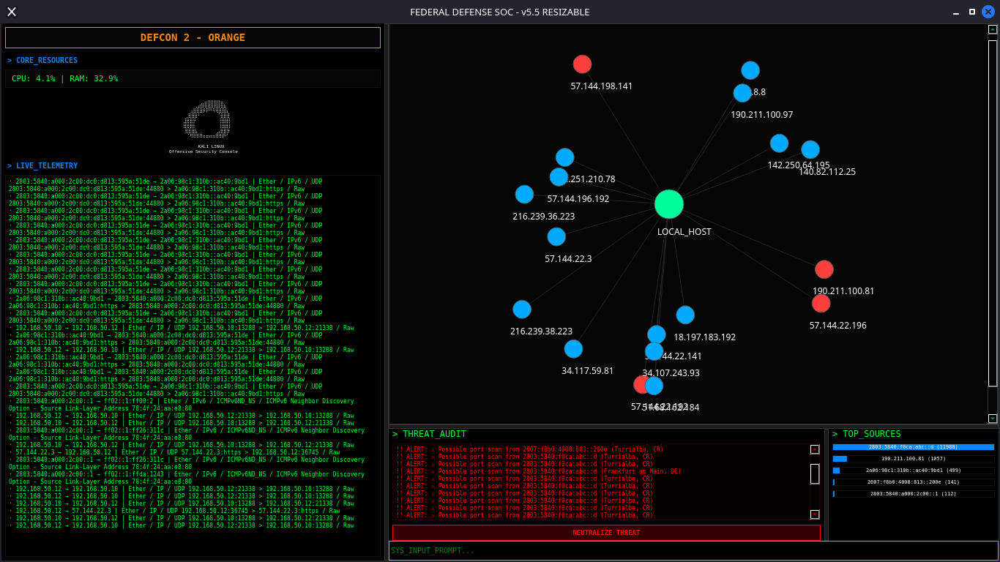

# 🔥 KALI SOC - Security Operations Center



## 📋 Descripción

Proyecto de **Security Operations Center (SOC)** para Kali Linux con múltiples versiones de dashboards de monitoreo y análisis de seguridad.

## 🚀 Versiones Disponibles

### 🐲 **kali-control-panel.sh** (Original)
- Versión básica en terminal
- Monitoreo de CPU/RAM/Red
- Detección simple de amenazas

### ⚡ **kali-control-panel-v2.sh** (Mejorado)
- Sistema de logs y alertas
- Detección avanzada de amenazas
- Análisis de tráfico mejorado

### 🛡️ **kali-control-panel-v3.sh** (Avanzado)
- Corrección de errores de formato
- Niveles de amenaza dinámicos
- Clasificación de peligrosidad de puertos

### 🌌 **kali-control-panel-v4.sh** (Cuántico)
- Tema púrpura cuántico
- AI Threat Detection
- Análisis de paquetes con IPs
- Memoria swap y arquitectura

### 🇪🇸 **kali-control-panel-v4-es.sh** (Español)
- Versión V4 completamente en español
- Corrección de errores de validación
- Interfaz traducida al español

## 🖥️ Aplicaciones GUI

### 📱 **app1/** (Dashboard Básico PyQt6)
- Interfaz gráfica simple
- Módulos: sniffer, network_map, geoip, ids
- Actualización automática

### 🎯 **app2/** (Dashboard Avanzado PyQt6)
- Interfaz sofisticada tipo hacker
- Sistema DEFCON con niveles de amenaza
- Whitelist de IPs, logging, análisis de tráfico
- Overlay de scanlines para efecto visual

## 🛠️ Características Principales

### 🔍 **Monitoreo en Tiempo Real**
- CPU, RAM, Disco con barras de progreso
- Tráfico de red (RX/TX)
- Conexiones establecidas
- Procesos activos

### 🛡️ **Detección de Amenazas**
- SYN flood attacks
- Port scanning
- Conexiones sospechosas
- Niveles de amenaza (BAJO/MEDIO/ALTO/CRÍTICO)

### 📊 **Análisis de Red**
- Mapa de red con dispositivos descubiertos
- Análisis de puertos abiertos
- Clasificación de peligrosidad
- Sniffer de paquetes en vivo

### 📝 **Sistema de Logs**
- Alertas críticas
- Historial de eventos
- Análisis de amenazas
- Estadísticas de sesión

## 🚀 Instalación y Uso

### Requisitos
- Kali Linux o distribución basada en Debian
- Python 3.8+ (para aplicaciones GUI)
- PyQt6 (para aplicaciones GUI)
- Herramientas de red: `arp-scan`, `tcpdump`, `ifstat`

### Instalación de Dependencias
```bash
# Para aplicaciones GUI
pip install PyQt6 psutil

# Herramientas de sistema
sudo apt update
sudo apt install arp-scan tcpdump ifstat
```

### Ejecución

#### Versiones Terminal
```bash
# Versión original
./kali-control-panel.sh

# Versión mejorada
./kali-control-panel-v2.sh

# Versión avanzada
./kali-control-panel-v3.sh

# Versión cuántica
./kali-control-panel-v4.sh

# Versión en español
./kali-control-panel-v4-es.sh
```

#### Aplicaciones GUI
```bash
# Dashboard básico
cd app1
python soc_panel.py

# Dashboard avanzado
cd app2
python soc_panel.py
```

## 📁 Estructura del Proyecto

```
kali-soc/
├── kali-control-panel.sh          # Versión original
├── kali-control-panel-v2.sh      # Versión mejorada
├── kali-control-panel-v3.sh      # Versión avanzada
├── kali-control-panel-v4.sh      # Versión cuántica
├── kali-control-panel-v4-es.sh   # Versión español
├── app1/                         # Dashboard GUI básico
│   ├── soc_panel.py
│   ├── modules/
│   │   ├── sniffer.py
│   │   ├── network_map.py
│   │   ├── geoip.py
│   │   └── ids.py
│   └── venv/
├── app2/                         # Dashboard GUI avanzado
│   ├── soc_panel.py
│   ├── modules/
│   │   ├── sniffer.py
│   │   ├── network_map.py
│   │   ├── geoip.py
│   │   ├── ids.py
│   │   └── utils.py
│   ├── logs/
│   └── venv/
├── .gitignore
└── README.md
```

## ⚙️ Configuración

Variables ajustables en cada script:
- `THRESHOLD_CPU`: Umbral de CPU (default: 80%)
- `THRESHOLD_RAM`: Umbral de RAM (default: 85%)
- `THRESHOLD_DISK`: Umbral de disco (default: 90%)
- `THRESHOLD_CONNECTIONS`: Umbral de conexiones (default: 50)

## 🎨 Personalización

### Colores
- RED: Alertas críticas
- YELLOW: Advertencias
- GREEN: Estado normal
- CYAN: Información
- MAG/PURPLE: Efectos visuales
- BLUE: Datos de red

### Temas
- **Terminal**: ASCII art con dragón
- **GUI**: Estilo cyberpunk/Matrix
- **Cuántico**: Tema púrpura avanzado

## 🔐 Seguridad

- Detección de ataques en tiempo real
- Análisis de tráfico sospechoso
- Monitoreo de puertos peligrosos
- Sistema de alertas por umbral
- Logs de eventos de seguridad

## 📈 Monitoreo

### Métricas del Sistema
- Uso de CPU con alertas
- Consumo de RAM
- Espacio en disco
- Carga del sistema
- Tiempo de actividad

### Métricas de Red
- Tráfico entrante/saliente
- Dispositivos en la red
- Puertos abiertos
- Conexiones establecidas
- Paquetes capturados

## 🚨 Alertas

### Tipos de Alertas
- **CRÍTICAS**: CPU/RAM/Disco sobre umbral
- **AMENAZAS**: Ataques detectados
- **INFORMATIVAS**: Cambios de estado

### Canales de Alerta
- Terminal en tiempo real
- Archivos de log
- Historial de eventos

## 🔄 Actualización

El panel se actualiza automáticamente cada 5 segundos para proporcionar información en tiempo real.

## 🛑 Salida

Presiona `Ctrl+C` para salir gracefulmente. Se mostrarán estadísticas finales de la sesión.

## 📝 Notas

- Los scripts requieren permisos de ejecución: `chmod +x *.sh`
- Algunas funciones requieren privilegios de root
- Los archivos temporales se guardan en `/tmp/`
- Las aplicaciones GUI usan hilos para operaciones concurrentes

## 👨‍💻 Autor

**fsociety** - Security Operations Center para Kali Linux

## 📄 Licencia

Este proyecto es para fines educativos y de investigación en ciberseguridad.

---

**⚠️ ADVERTENCIA**: Usar solo en redes propias o con permiso explícito.
